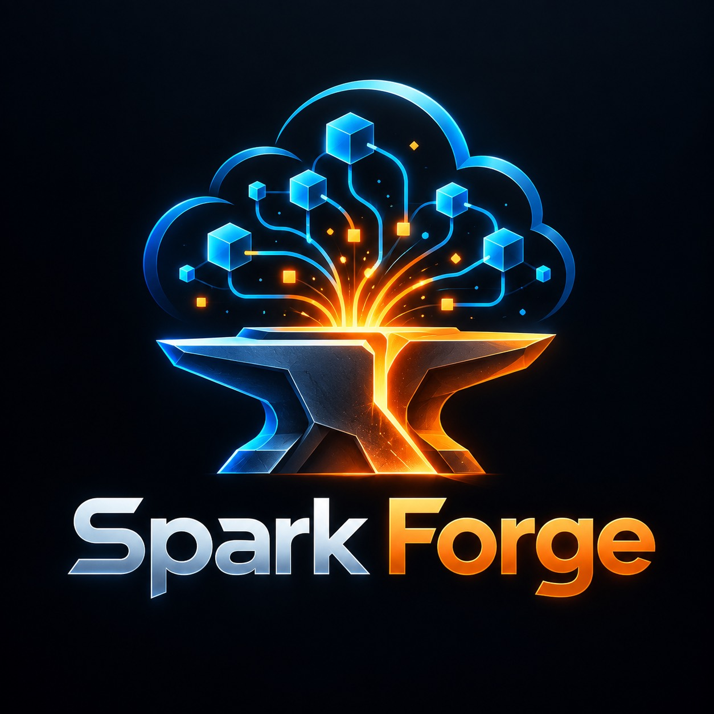

# SparkForge AWS

<p align="center">
  
</p>

O SparkForge julga jobs Spark por artefato. Ele lê o que o job deixou — código PySpark,
plano físico, event log, rodapé Parquet, metadata Iceberg, definição do job ou do
cluster, log do CloudWatch, permissão do Lake Formation — e devolve **facts** medidos,
**findings** com a regra e a fonte que os sustentam, e **recusa com nome** para o que a
evidência não alcança. Roda sobre AWS Glue, Amazon EMR (on EC2, Serverless e on EKS) e
Databricks declarado, com Photon reconhecido no plano.

O que ele **não** é:

- **Não chama provider de modelo.** `sparkforge/` não importa `anthropic`, `openai`,
  `bedrock` nem `litellm`. Quem gasta token é o host que executa os agents.
- **Não estima ganho sem medida.** "Vai ficar 30% mais rápido" exige o run que ainda não
  aconteceu. `expected_gain` é recusado pelo schema, e um ganho só entra citando o
  `fact_id` de um `bench.run_delta` medido.
- **Não aplica mudança.** Todo verbo descreve. `change sandbox` aplica numa cópia, nunca
  na árvore do operador.

**Primeira vez aqui?** Comece pelo [Guia do SparkForge](docs/guia/README.md): manuais
por tarefa, com receita para copiar e colar, e uma referência de cada comando, tool,
agent e skill gerada do código.

Para ver o que foi entregue nas waves de control plane, streaming, CDC, economia
observada e Forge Lab, consulte o [mapa de evolução atual](docs/EVOLUTION-CURRENT.md)
e o [ledger completo de entrega](docs/DELIVERY-LEDGER.md).

## Como ele pensa: extrair, julgar, compor

Três etapas, e cada uma é um verbo diferente.

| Etapa | Verbo | Lê | Devolve |
|---|---|---|---|
| Extrair | `analyze <alvo>` | o artefato, offline | facts (`fact_id`, `kind`, `measures`, `attrs`) |
| Julgar | `judge` | facts + catálogo de regras | findings, com `evidence` apontando o `fact_id` |
| Compor | `workload`, `capacity`, `finops`, `tune`, `benchmark`, `funcval`, `arbitrate`... | facts que outro verbo já extraiu | uma resposta maior, ou a recusa nomeada |

**Fact → regra → recusa nomeada.** Custo é fact, limiar é regra, valor proposto não é
nenhum dos dois — mora em `tune`, fora do catálogo. Onde falta base, sai `refused` com a
medida que destravaria a resposta, ou um fact `*.unresolved`. "Não sei, e para saber você
precisa do event log" vale mais que um número sem lastro.

**Por que extração e julgamento são verbos separados.** Facts de código-fonte são caros
de recomputar; o catálogo muda mais depressa que o código. Separar os dois permite
**rejulgar facts antigos com um catálogo novo sem reprocessar o código-fonte**, e o diff
do resultado mostra só o que mudou no julgamento. Detalhe em
[Extrair, julgar, compor](docs/guia/06-extrair-julgar-compor.md#por-que-extração-e-julgamento-são-verbos-separados).

Os 59 extratores emitem 367 kinds distintos de fact, e só `collect *` toca a AWS. O
catálogo tem **218** regras de diagnóstico em YAML, **218 delas executáveis** (todas), cada uma
com `rule_id`, limiar, guarda de versão, fonte com data e um bloco `action:` de
vocabulário fechado. As contagens passam pelo gate
`python scripts/check_status_numbers.py --strict`, que confere cada uma contra a medida;
a tabela *Números correntes* de [`docs/superpowers/STATUS.md`](docs/superpowers/STATUS.md)
guarda as demais. O catálogo por área está em
[Conhecimento e catálogo](docs/guia/07-conhecimento-e-catalogo.md).

## Plataformas, e o que cada uma exige

A análise de código, plano, event log, Parquet e Iceberg é a mesma em qualquer
plataforma. Muda o eixo de infraestrutura, e muda de onde vem a versão — que é o que
decide qual limiar vale.

| Plataforma | De onde vem a versão | Artefato de infraestrutura | Matriz de runtime |
|---|---|---|---|
| AWS Glue | `--glue <versão>`, ou `glue_version` do Terraform | `analyze terraform`, `analyze glue-job-runs` | [`knowledge/glue/runtime-matrix.md`](knowledge/glue/runtime-matrix.md) |
| EMR on EC2 | o dump de `describe-cluster`, ou `--emr <release>` declarado | `analyze emr-cluster` | [`knowledge/emr/runtime-matrix.md`](knowledge/emr/runtime-matrix.md) |
| EMR Serverless | não entra no runtime: a AWS não publica a matriz de release | `analyze emr-serverless` | [`knowledge/emr-serverless/runtime-matrix.md`](knowledge/emr-serverless/runtime-matrix.md) |
| EMR on EKS | não entra no runtime: a matriz publicada diverge da de EC2, e `--emr` é recusado sobre facts `emrc.*` | `analyze emr-eks` | [`knowledge/emr-eks/runtime-matrix.md`](knowledge/emr-eks/runtime-matrix.md) |
| Databricks (declarado) | `--databricks <versão>` (`15.4` ou `15.4.x-scala2.12`); Photon por `--photon on\|off` ou pelo fact `plan.photon` | nenhum coletor: sem `_delta_log`, Jobs API, DBU ou REST API | [`knowledge/databricks/runtime-matrix.md`](knowledge/databricks/runtime-matrix.md) |

Declaração perde para observação. `--emr` perde para o dump e para o event log, e a
discordância vira divergência reportada, nunca valor trocado em silêncio. Sob Databricks,
um plano com operadores Photon põe as regras de plano em `skipped` com
`databricks.photon.unresolved` — com ou sem a flag —, e sem declaração nem plano Photon a
regra `SF-ENV-006` avisa. As regras `SF-ENV` julgam ambiente e versão em qualquer
plataforma. O AWS Glue 6.0 e a fronteira do Spark 4 têm documentação própria em
[`docs/aws/glue/6.0/`](docs/aws/glue/6.0/README.md). O detalhe, plataforma por plataforma,
está em [Extrair, julgar, compor](docs/guia/06-extrair-julgar-compor.md).

## Início rápido

```bash
pip install sparkforge-aws            # ou, no clone: pip install -e .
sparkforge runtime detect --glue 5.0
sparkforge analyze pyspark --path lib/ --out .sparkforge/facts.json
sparkforge judge --facts .sparkforge/facts.json --glue 5.0 --out .sparkforge/findings.json
sparkforge next-step --repo . --findings .sparkforge/findings.json
```

`--facts` é repetível: `judge` correlaciona código e infraestrutura numa chamada só. No
EMR on EC2 a release vem do dump, sem flag de versão:

```bash
sparkforge analyze emr-cluster --path cluster.json --out .sparkforge/facts-emr.json
sparkforge judge --facts .sparkforge/facts-emr.json --facts .sparkforge/facts.json \
  --out .sparkforge/findings.json
```

No Databricks, a versão e o Photon são declarados:

```bash
sparkforge judge --facts .sparkforge/facts.json --databricks 15.4 --photon on \
  --out .sparkforge/findings.json
```

O pacote instalado carrega o catálogo de regras e `knowledge/` dentro do wheel:
`analyze`, `judge`, `next-step`, `resume` e `rules lookup` funcionam sem o repositório
clonado. Extras, verificação e erros comuns em [Instalação](docs/guia/02-instalacao.md);
a anatomia de cada comando e um fluxo rodado de verdade em [CLI](docs/guia/03-cli.md).

## Forge Lab / Digital Twin

O Forge Lab transforma cenários streaming e batch em planos de ações
allowlisted, executa localmente somente com autorização explícita, captura
artefatos com hash e compara a observação com um oracle independente. Compose e
Testcontainers consomem a mesma DSL; a AWS é um tier separado e nunca é tocada
pelo core offline.

```bash
sparkforge lab doctor
sparkforge lab verify --repo .
sparkforge lab scenarios --json --repo .
sparkforge lab plan iceberg-small-files --backend compose --seed 42 --repo .
```

O produto entregue possui registry com 11 componentes, Golden 20 com 240 ações
compiladas, receipts, promoção revisada de fixtures, equivalência multi-engine,
profiles de streaming/batch/CDC/lakehouse/observabilidade/chaos e tiers L0–L3.
`verify` não inicia Docker. Execuções mutáveis exigem `--execute --confirm`; um
run local não prova capacidade, custo, latência ou semântica AWS de produção.
O detalhe está no [guia do Forge Lab](docs/guia/forge-lab.md) e no
[contrato técnico](docs/knowledge/forge-lab-product.md).

## SLO observado em streaming

O compositor `analyze streaming-composition` pode avaliar um contrato SLO
declarado contra facts diretamente observados, sem acessar Spark, Kafka, Kinesis
ou AWS em modo offline. Há quatro formas de observação suportadas: progress de
batch, saída de sink, lag Kafka e iterator age Kinesis:

```bash
# progress Structured Streaming
sparkforge analyze streaming-composition \
  --facts slo-contract.facts.json --facts progress.facts.json \
  --mode slo --slo-name throughput --query-name orders-query \
  --out slo-evaluation.facts.json

# saída observada do sink, ligada ao batch por batch_id/query_name
sparkforge analyze streaming-composition \
  --facts slo-contract.facts.json --facts progress.facts.json \
  --mode slo --slo-name output-rows --query-name orders-query \
  --sink-name orders-sink --out sink-slo.facts.json

# lag Kafka ou iterator age Kinesis
sparkforge analyze streaming-composition \
  --facts slo-contract.facts.json --facts transport.facts.json \
  --mode slo --slo-name consumer-lag --transport-key orders-group \
  --out transport-slo.facts.json
```

Sink usa `num_output_rows` em `rows` e só é resolvido quando há um batch único
com `batch_id`, `query_name` e timestamp. Kafka usa `kafka.lag` em `records`;
Kinesis usa `kinesis.shard` em `ms` para `iterator_age_ms`. `statistic: p95`
calcula nearest-rank sobre a série observada; `freshness_ms` usa
`timestamp - eventTime.max`, e end-to-end latency exige campo explícito. A avaliação exige
identidade, unidade canônica, timestamps e janela declarada coberta; séries
misturadas, janela incompleta ou evidência ausente saem como
`streaming.slo.unresolved`. `met` e `violated` significam somente o comparador
observado no artefato: não são disponibilidade, causalidade ou saúde end-to-end.
Detalhe em
[cobertura do prompt de streaming](docs/streaming/prompt-coverage.md) e na
[referência da skill](docs/guia/referencia/skills/analyze-streaming-composition.md).

### Apache Flink: source e sink como evidência separada

O analyzer offline de Flink preserva `flink.source` e `flink.sink` quando o dump
traz `sources`/`source` e `sinks`/`sink`. Identidade, connector,
`delivery_semantics`, contadores, backlog/lag e commits pendentes são copiados
somente quando observados; `num_records_in`/`num_records_out` não são
throughput sem timestamp e janela. Ausência ou formato inválido publica
`flink.unresolved` com razão nomeada, nunca zero. O namespace
`managed_flink.*` permanece separado. Isso não prova exactly-once, saúde ou
capacidade; correlacione os facts com checkpoint, operator, runtime e série
temporal. Detalhes em [`knowledge/flink-streaming.md`](knowledge/flink-streaming.md)
e na [cobertura de streaming](docs/streaming/prompt-coverage.md).

### Glue Streaming: efetivo versus Terraform

Quando o caso inclui a definição efetiva do job e o Terraform do mesmo ambiente,
extraia os dois artefatos e componha os facts antes de julgar:

```bash
sparkforge analyze glue-streaming --path effective-job.json --out glue.facts.json
sparkforge analyze terraform --path infra/ --out terraform.facts.json
sparkforge fuse --facts glue.facts.json --facts terraform.facts.json --out fused.facts.json
sparkforge judge --facts fused.facts.json --show-skipped
```

`fuse` só liga `aws_glue_job` por `name` literal único. O fact
`glue.streaming.terraform_link` compara `glue_version`, Real-Time Mode,
linguagem e workers, preserva `source_fact_ids` e distingue `drifts` de
`unresolved_fields`. `SF-GLUESTREAM-004` sinaliza divergência; `SF-GLUESTREAM-005`
registra identidade ou valor não resolvido. Esse contrato não prova execução,
capacidade, custo, latência ou validação funcional.

Com histórico terminal sanitizado, componha também a definição com
`glue.job_run`:

```bash
sparkforge analyze glue-job-runs --path .sparkforge/artifacts/glue_job_run --out runs.facts.json
sparkforge fuse --facts glue.facts.json --facts runs.facts.json --out runtime.facts.json
sparkforge judge --facts runtime.facts.json --show-skipped
```

`glue.streaming.runtime_link` compara `glue_version`, `worker_type` e
`worker_count` por nome literal e preserva `observed_run_ids`, `drifts` e
`source_fact_ids`. `SF-GLUESTREAM-006` aponta drift; `SF-GLUESTREAM-007`
mantém ausência de run/identidade/campo como unresolved. Duração e DPU do run
não são latência, saúde ou custo atribuído.

### Glue Streaming: source e sink explícitos

O mesmo analyzer também preserva `glue.streaming.source` e
`glue.streaming.sink` quando `stream.sources`/`source` e `stream.sinks`/`sink`
estão declarados como objeto ou lista. Identidade, connector, topic/stream/table
e medidas de partições, shards, lag, registros, commits ou falhas são mantidos
somente quando observados. Estruturas desconhecidas são descartadas e campos
ausentes não viram zero; ausência ou forma inválida vira
`glue.streaming.unresolved` com razão nomeada. Esses facts não provam execução
live, throughput, saúde, exactly-once, capacidade ou validação funcional.
Detalhes em [`knowledge/glue-streaming-rtm.md`](knowledge/glue-streaming-rtm.md)
e na [cobertura de streaming](docs/streaming/prompt-coverage.md).

Para usar o SparkForge em qualquer repositório da máquina sem copiar nada para ele,
integre uma vez por host:

```bash
sparkforge integrate all --scope user --dry-run   # lista o que seria escrito
sparkforge integrate all --scope user             # Claude Code, Devin, Codex e Copilot CLI
sparkforge detach all                             # desfaz, removendo só o que foi escrito
```

Os caminhos de cada host, o manifesto e a cópia em dobro no repositório estão em
[Instalação](docs/guia/02-instalacao.md#integrar-uma-vez-por-máquina-sparkforge-integrate).

## Canais

O mesmo motor chega por cinco caminhos. A tool MCP e o comando da CLI são o mesmo código
(`sparkforge/adapters/_core.py`), e o servidor publica **134 tools MCP**.

| Canal | Como chega | Onde está o detalhe |
|---|---|---|
| Claude Code | plugin (`.claude-plugin/plugin.json`), `.claude/skills`, `.claude/agents`, MCP por `.mcp.json` | [MCP](docs/guia/04-mcp.md), [Agents e skills](docs/guia/05-agents-e-skills.md) |
| Devin (CLI e Desktop) | `.agents/skills`, `.agents/agents` (e importa `.claude/agents`), MCP por `.devin/mcp_config.json` (stdio) ou HTTP | [MCP](docs/guia/04-mcp.md#devin-cli-stdio) |
| GitHub Copilot | `.github/copilot-instructions.md`, `.github/instructions`, `.github/prompts`, `.github/agents`; usa a CLI | [Agents e skills](docs/guia/05-agents-e-skills.md#github-copilot) |
| Agent Skills | `skills/`, para qualquer agente compatível com o padrão | [Referência de skills](docs/guia/referencia/skills/README.md) |
| `pip` e espelhos markdown | `pip install sparkforge-aws` dá a CLI `sparkforge` em qualquer shell ou CI; sem MCP e sem Python, `rules/catalog/*.yaml`, `skills/` e `knowledge/` se leem direto | [Instalação](docs/guia/02-instalacao.md#canais-de-distribuição) |

**Duas camadas de agente.** O **coordenador** (**14 coordenadores** em `agents/*.md`) lê o
case, decide qual executor roda e registra o resultado. O **executor** (**5 executores**
em `agents/executors/`) faz uma função só — inventário, extração, julgamento, verificação,
síntese — com `## Não faz` declarado. Qual coordenador usar é dado: `next-step` consulta
as rotas de `rules/catalog/routing.yaml`. Onde o despacho de subagente não existe ou está
desligado, `sparkforge playbook <coordenador>` devolve os mesmos passos em ordem. O repositório
traz **60 skills**; as de diagnóstico e as onze de procedimento AWS estão em
[Agents e skills](docs/guia/05-agents-e-skills.md).

## SDD próprio

Mudança não trivial passa por spec antes de código, com gate determinístico: o agente
escreve os artefatos, e o pacote confere o que dá para conferir e recusa o resto por
nome. As skills `sdd-explore`, `sdd-define`, `sdd-design`, `sdd-plan`, `sdd-build` e
`sdd-ship` produzem `docs/sdd/<FEATURE>/<fase>.md`; `sparkforge sdd check --repo .
--feature <F>` confere schema, cascata por hash, cobertura e TDD declarado, e
`sdd status` e `sdd stamp` mostram a fase e gravam o hash do upstream. Dois perfis:
**dev** (este repositório) e **operator** (o job do operador, com a mudança sempre por
`sparkforge change sandbox`). Fluxo completo em [`docs/sdd/README.md`](docs/sdd/README.md).

## Investigação, prova e handoff

O case (`.sparkforge/case.yaml`) atravessa sessões e ferramentas. Com `--strict-gates`,
a fase só avança com a evidência que destrava cada gate — o benchmark, o call graph, o
plano de validação funcional —, nunca com a flag. `report sign` e `report verify` provam
**correspondência** entre relatório e findings, não autoria. `report github` projeta os
findings em SARIF para o Code Scanning.

Ao pausar, `sparkforge handoff --repo .` escreve `.sparkforge/handoff.md`, e cinco
arquivos pequenos viram o barramento entre sessões:

```bash
git add .sparkforge/case.yaml .sparkforge/facts.json .sparkforge/findings.json .sparkforge/handoff.md .sparkforge/artifacts/manifest.json
```

`.sparkforge/artifacts/**` nunca é commitado, exceto o `manifest.json`: o artefato bruto
pode carregar dado de negócio e ter centenas de MB. O manifesto guarda `sha256`, origem e
o comando exato de recoleta. Detalhe em [Rigor, assinatura e handoff](docs/guia/08-rigor-e-handoff.md).

## Camada agêntica e economia

`sparkforge arbitrate` roda depois de `judge` e grava `Claim`, `Evidence`,
`Contradiction`, `Unknown` e `Decision` no blackboard do case. Quando a arbitragem não
fecha, `sparkforge debate start|next|submit` conduz o debate como máquina de estados; o
argumento é escrito pelo host, nunca dentro do pacote. Os dois executores são **L0**:
`applied_changes` sai sempre `false`, e o ADR é proposta com `rollback` obrigatório.

**Não há benchmark da camada agêntica, e por isso não há afirmação de ganho.** O debate
alcança um único par de regras, que só existe na união dos facts de dois jobs; o baseline
de modelo não foi rodado. Detalhe em [Camada agêntica](docs/guia/09-camada-agentica.md) e
[`evals/README.md`](evals/README.md).

Economia se mede, não se afirma. `sparkforge economy report` lê os spans que cada chamada
grava e separa **byte de payload**, que o SparkForge produz e sempre existe, de **token de
provider**, que só aparece com o transcript do host — sem ele sai `tokens_unresolved`, e
os dois nunca se somam. `detail_level` (`summary`, `normal`, `full`) muda o tamanho da
resposta; antes de afirmar que reduziu, leia o número. As medidas com data, e o
denominador de cada uma, estão nos documentos auditados por
`python scripts/check_vnext_claims.py`: seções 10 e 14 de
[`docs/harness/CODEINTEL-GAP.md`](docs/harness/CODEINTEL-GAP.md). Como medir uma sessão:
[Economia de contexto](docs/guia/usos/economia-de-contexto.md). A compressão de output
(caveman, ligada por padrão e vendorizada sem `npm`) está em
[Ecossistema caveman](docs/guia/10-caveman.md).

## Segurança e operações destrutivas

Clonar e abrir o Claude Code **executa código**: o hook de policy (`PreToolUse`), os hooks
de `SessionStart` e o servidor MCP. `tests/test_execution_surface.py` trava a **string
exata** de cada comando, e um deny-list recusa `curl`, `| sh`, `eval` e parentes. A policy
de `.sparkforge/policy.yaml` decide o que o agente faz sozinho, o que pede confirmação e o
que é proibido.

Nenhuma skill e nenhum agent executam manutenção destrutiva. Expirar snapshot, remover
arquivo órfão, mudar particionamento ou sobrescrever partição é **proposto**, com escopo,
retenção, dry run quando houver e rollback — e quem confirma é o operador. As onze skills
AWS de procedimento podem mutar infraestrutura viva, e por isso são não-despacháveis e
exigem confirmação por comando de escrita. Detalhe em [Segurança](docs/guia/11-seguranca.md)
e [Política de segurança](docs/guia/usos/politica-de-seguranca.md).

## Mapa da documentação

| Quero... | Onde |
|---|---|
| Começar, com receita para copiar e colar | [`docs/guia/README.md`](docs/guia/README.md) |
| Construir evidência reproduzível de streaming e batch | [Forge Lab / Digital Twin](docs/guia/forge-lab.md) |
| Ver o estado consolidado das evoluções | [Mapa de evolução atual](docs/EVOLUTION-CURRENT.md) |
| O glossário, os objetivos e os dados mínimos a juntar | [Conceitos](docs/guia/01-conceitos.md) |
| Instalar, e usar sem o repositório clonado | [Instalação](docs/guia/02-instalacao.md) |
| Ler a saída da CLI e seus códigos de saída | [CLI](docs/guia/03-cli.md) |
| Ligar o MCP em cada cliente | [MCP](docs/guia/04-mcp.md) |
| Saber qual agent ou skill usar | [Agents e skills](docs/guia/05-agents-e-skills.md) |
| O que cada extrator lê, plataforma por plataforma | [Extrair, julgar, compor](docs/guia/06-extrair-julgar-compor.md) |
| O conhecimento, o catálogo e as áreas de regra | [Conhecimento e catálogo](docs/guia/07-conhecimento-e-catalogo.md) |
| Gates, assinatura, Code Scanning e handoff | [Rigor, assinatura e handoff](docs/guia/08-rigor-e-handoff.md) |
| Arbitragem, debate e o que a camada agêntica não afirma | [Camada agêntica](docs/guia/09-camada-agentica.md) |
| Compressão de output | [Ecossistema caveman](docs/guia/10-caveman.md) |
| O que executa ao clonar | [Segurança](docs/guia/11-seguranca.md) |
| Manter espelhos, locks e wheel (contribuidores) | [Espelhos e dependências](docs/guia/12-espelhos-e-dependencias.md) |
| Um manual por tarefa: job lento, custo, Iceberg, Lake Formation, migração | [Manuais por tarefa](docs/guia/README.md#manuais-por-tarefa) |
| Cada comando, tool, agent e skill, gerado do código | [Referência](docs/guia/README.md#referência-completa) |
| Como Spark, Glue, EMR, Athena, Parquet e Iceberg se comportam | [`knowledge/INDEX.md`](knowledge/INDEX.md) |
| As regras em YAML, legíveis sem Python | [`rules/catalog/README.md`](rules/catalog/README.md) |
| Especificar uma mudança antes de construir | [`docs/sdd/README.md`](docs/sdd/README.md) |
| Qual gate cada tipo de mudança toca | [`docs/gates-por-mudanca.md`](docs/gates-por-mudanca.md) |
| Os números correntes, e o estado de cada fase | [`docs/superpowers/STATUS.md`](docs/superpowers/STATUS.md) |
| O protocolo que todo agent segue | [`AGENT_PROTOCOL.md`](AGENT_PROTOCOL.md), [`AGENTS.md`](AGENTS.md) |
| Fluxos full e incrementais (latest-per-key, batching, OOM) | [`PROMPT_INICIAL_MESTRE.md`](PROMPT_INICIAL_MESTRE.md), [`GUIA_DE_USO.md`](GUIA_DE_USO.md) |
| Contribuir | [`CONTRIBUTING.md`](CONTRIBUTING.md) |
| Créditos de terceiros | [`vendor/CREDITS.md`](vendor/CREDITS.md) |

## Regra central

> Não ajustar por intuição. Medir, formular hipótese, testar isoladamente e validar o
> resultado funcional.
