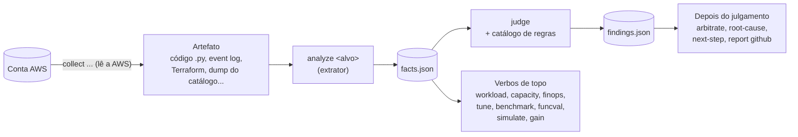

# Conceitos do SparkForge

Este guia explica o que o SparkForge é e o que significa cada palavra da saída
dos comandos. Os outros guias usam estes termos sem repetir a explicação.

## Receita rápida

Veja as três peças principais funcionando em menos de um minuto. Rode na raiz
do repositório clonado, com o SparkForge instalado
([Instalação](02-instalacao.md)).

```bash
# 1. Uma pasta temporária para as saídas
export TMP=/tmp/sparkforge_guia && mkdir -p "$TMP"

# 2. Extrair fatos de um código PySpark de exemplo
sparkforge analyze pyspark --path fixtures/pyspark/python_udf/input --out "$TMP/facts.json"

# 3. Julgar esses fatos contra o catálogo de regras
sparkforge judge --facts "$TMP/facts.json" --glue 5.0

# 4. Ler a regra que disparou
sparkforge rules lookup --id SF-PY-001
```

O que você deve ver:

- no passo 2, `"total_count": 3`: três **facts** (fatos observados no código);
- no passo 3, `"by_severity": {"P1": 1}`: um **finding** (achado) da regra
  `SF-PY-001`, que aponta a UDF em Python na linha 5 de `lib/job.py`;
- no passo 4, a **regra** completa: a condição, a explicação e as fontes.

Artefato, fact, finding e regra: é isso que o resto do guia explica.

## O que é o SparkForge

O SparkForge é uma ferramenta para investigar desempenho e riscos de jobs
PySpark que rodam no AWS Glue. Ele também cobre o que fica em volta desses
jobs: arquivos Parquet, tabelas Apache Iceberg, consultas no Amazon Athena,
clusters Amazon EMR e a definição da infraestrutura em Terraform.

Ele tem duas metades:

1. **Analisadores determinísticos.** "Determinístico" quer dizer que a mesma
   entrada produz sempre a mesma saída. Não há sorteio, não há modelo de
   linguagem, não há palpite. Você aponta um arquivo, o SparkForge lê esse
   arquivo e devolve um JSON. Rodou duas vezes, recebeu o mesmo JSON duas
   vezes. Essa metade é a CLI `sparkforge` e as tools MCP.
2. **Agents e skills.** São instruções escritas em Markdown para assistentes
   de IA (Claude Code, Devin, GitHub Copilot, Codex). Elas dizem ao assistente
   em que ordem chamar os analisadores e como apresentar o resultado. O
   assistente segue o roteiro; quem produz os números é sempre a metade
   determinística.

O projeto em si não chama nenhum modelo de linguagem. Quem gasta token é o
assistente que você usa. O SparkForge só lê arquivos e devolve dados.

## Por que ele recusa chutar

A maior parte das recomendações de tuning de Spark que circulam por aí é
palpite: "aumente os workers", "mude o número de partições para 400". O
SparkForge foi construído para não fazer isso. Cada afirmação dele precisa de
uma de três coisas:

- uma **medida** tirada de um artefato (por exemplo, quantos bytes o shuffle
  escreveu, lido do event log do Spark);
- uma **regra** escrita no catálogo, com fonte oficial citada;
- uma **declaração sua** (por exemplo, o SLA do job).

Quando falta a base, ele não inventa um número. Ele devolve uma **recusa
nomeada**: diz o que não sabe, por que não sabe e qual medida destravaria a
resposta. Isso aparece na saída como `refused` ou como um fact cujo `kind`
termina em `.unresolved`.

Pense nisso como qualidade, não como erro. Um "não sei, e para saber você
precisa do event log" é mais útil do que um número bonito sem base. Exemplo
real: o comando `tune` rodado sobre um fixture sem medida de shuffle devolve,
entre outras, esta recusa:

```json
{
  "reason": "no_shuffle_measured",
  "property": "spark.sql.shuffle.partitions",
  "detail": "Nenhum `spark.stage.shuffle` com `write_bytes` acima de zero. Zero particoes nao e configuracao, e um job sem shuffle nao tem o que paralelizar aqui. `sparkforge analyze event-log` produz a medida."
}
```

O texto já diz o próximo passo: rodar `sparkforge analyze event-log`.

## Como as peças se encaixam

O fluxo básico tem três etapas. Primeiro você **extrai** fatos de um artefato.
Depois você **julga** esses fatos contra o catálogo de regras. Por fim, se
quiser, você **compõe** respostas maiores (perfil de workload, capacidade,
custo, configuração) em cima dos fatos já extraídos.



Duas coisas importantes sobre o desenho:

- Só `analyze` e `collect` leem artefato. Os verbos de topo **não** leem
  arquivo de código nem log: eles consomem facts que `analyze` já produziu.
  Por isso, se um verbo de topo reclamar de falta de dado, a correção é quase
  sempre rodar mais um `analyze`.
- `collect` é o único grupo que fala com a AWS (precisa de credenciais e do
  extra `aws`, veja [Instalação](02-instalacao.md)). Todo o resto roda
  offline, sobre arquivos que você já tem.

## Um fact e um finding reais

Os exemplos abaixo vêm do fixture `fixtures/pyspark/python_udf/`, que é
sintético e está no repositório. O código analisado tem uma função
decorada com `@udf(returnType=StringType())`.

Este é um **fact** do golden `fixtures/pyspark/python_udf/expected/facts.json`.
Ele só constata: "na linha 5 de `lib/job.py` existe uma UDF do tipo Python".
Não diz se isso é bom ou ruim.

```json
{
  "id": "f_726c0b",
  "schema_version": 1,
  "kind": "pyspark.udf",
  "subject": {
    "type": "source_location",
    "file": "lib/job.py",
    "line": 5,
    "col": 1,
    "end_line": 5,
    "symbol": "trivial",
    "snippet": "@udf(returnType=StringType())"
  },
  "measures": {},
  "attrs": {
    "udf_type": "python"
  },
  "provenance": {
    "artifact": "lib/job.py",
    "artifact_sha256": "41d792f9e0c955feae464ef7f208bc2eda6464dddae9580737852f83c2de6b3a",
    "extractor": "pyspark_ast@0.1.0"
  }
}
```

Este é o **finding** correspondente, do golden
`fixtures/pyspark/python_udf/expected/findings.json` (encurtado com `...`).
Aqui sim há um juízo: a regra `SF-PY-001` diz que isso é um problema de
prioridade P1, explica por quê, propõe a mudança e diz como validar e como
desfazer.

```json
{
  "rule_id": "SF-PY-001",
  "schema_version": 1,
  "catalog_version": 1,
  "title": "Python UDF em transformação expressável nativamente",
  "severity": "P1",
  "confidence": "high",
  "status": "structural",
  "subject": { "type": "source_location", "file": "lib/job.py", "line": 5, "...": "..." },
  "evidence": ["f_726c0b"],
  "measured": {},
  "threshold": {},
  "runtime_scope": {},
  "explanation": "Python UDF custa, por linha: serialização JVM->pickle, ...",
  "proposed_change": [
    "Reescrever com funções Spark SQL nativas.",
    "..."
  ],
  "expected_effect": "",
  "benchmark_ref": "",
  "risks": ["Reescrita pode alterar tratamento de null ou de tipo em borda.", "..."],
  "tradeoffs": ["Expressão nativa equivalente pode ficar mais verbosa e menos legível."],
  "validation": ["Contagem total idêntica.", "..."],
  "rollback": ["Reverter o commit; a UDF original não depende de mudança de infraestrutura."],
  "sources": [
    { "url": "https://spark.apache.org/docs/3.5.6/sql-performance-tuning.html", "retrieved": "2026-07-29" }
  ],
  "action": {
    "kind": "code.replace_udf_with_native",
    "target": "pyspark.udf",
    "direction": "replace",
    "requires_absent": [],
    "moves": ["correctness.write_result"],
    "depends_on": []
  }
}
```

Repare no campo `evidence`: ele aponta para `f_726c0b`, o `id` do fact acima.
Todo finding aponta para pelo menos um fact. Um finding sem fact é inválido e
o próprio schema recusa.

Repare também que `expected_effect` está vazio. O SparkForge não promete "vai
ficar 30% mais rápido" sem ter medido antes e depois. Veja o verbete
[finding](#finding) abaixo.

## Glossário

Os termos estão em ordem alfabética. Cada verbete tem um exemplo curto.

### Agent

Um agent (agente) é um perfil em Markdown que diz a um assistente de IA como
conduzir um tipo de investigação. Os agents do SparkForge ficam em `agents/`.
Eles não executam análise: decidem **o que** rodar e em que ordem, e o
trabalho de verdade é feito pelas tools e pela CLI.

Exemplo: o agent `spark-performance-architect` coordena o diagnóstico geral de
um job PySpark no Glue quando o gargalo ainda não foi localizado.

Lista e descrição de cada um: [referência de agents](referencia/agents/README.md).
Veja também [coordenador e executor](#coordenador-e-executor).

### Artefato

Artefato é qualquer arquivo que descreve o job ou a execução dele e que o
SparkForge sabe ler. Exemplos: o código `.py` do job, o event log do Spark
(`.jsonl`), o texto de um plano físico (`df.explain("formatted")`), o `.tf` do
Terraform, um dump JSON do Glue Data Catalog, um dump de metadata de tabela
Iceberg.

Exemplo: em `sparkforge analyze pyspark --path lib/`, o artefato é a pasta
`lib/` com o código.

O SparkForge **nunca** importa nem executa o código analisado. Ele lê o texto
(no caso do PySpark, pela árvore sintática do Python).

### Case

Case é o estado de uma investigação, gravado em `.sparkforge/case.yaml` no
repositório que você está analisando. Ele guarda o runtime, a fase atual, os
gates (condições que precisam estar cumpridas para avançar), as hipóteses e as
skills já usadas. Serve para retomar a investigação em outra sessão ou em
outra ferramenta sem perder o fio.

Exemplo: `sparkforge case open --repo . --case-id meu-caso --now 2026-09-13T10:00:00Z --glue 5.0`
cria o arquivo com `phase: intake`. O guia [CLI](03-cli.md) mostra a saída.

### Catálogo de regras e regra

Uma **regra** é uma condição escrita em YAML que, quando os facts a
satisfazem, gera um finding. O **catálogo** é o conjunto de regras, em
`rules/catalog/`. Cada regra tem um identificador no formato
`<PREFIXO>-<ÁREA>-<NNN>`, por exemplo `SF-PY-001`. Cada regra declara os facts
de que precisa (`requires_facts`), a condição (`when`), a severidade padrão,
a explicação, a mudança proposta, riscos, validação, rollback e as fontes
oficiais.

Exemplo: `sparkforge rules lookup --id SF-PY-001` mostra que a regra exige o
fact `pyspark.udf` com `attrs.udf_type` igual a `python`.

A contagem de regras muda com o tempo. Não confie em número escrito em
documento: consulte o catálogo com `rules lookup`.

### Coordenador e executor

São os dois papéis de agent.

- **Coordenador** é um agent em `agents/*.md` que olha o case, decide qual
  passo roda em seguida e registra no case o que foi feito. Ele não executa
  análise.
- **Executor** é um agent em `agents/executors/*.md` responsável por uma função
  do ciclo de investigação: `sf-inventory`, `sf-extractor`, `sf-judge`,
  `sf-verifier` e `sf-synthesizer`. Cada um tem uma seção `## Não faz` que
  diz o que está fora do papel dele.

Exemplo: `sparkforge playbook spark-performance-architect` devolve a sequência
de passos que o coordenador executaria, útil em ferramentas que não despacham
subagentes.

### detail_level

É o nível de detalhe da resposta de alguns comandos e tools. Tem três valores:

- `full` (o padrão na CLI): cada fact completo, com a procedência dentro de
  cada item. É o modo para reauditar.
- `normal`: a procedência aparece uma vez no envelope da resposta, e cada item
  aponta para ela por `provenance_ref`.
- `summary`: cada item fica reduzido a id, kind, medidas, `arquivo:linha` e
  símbolo.

Exemplo: `sparkforge analyze pyspark --path lib/ --detail-level summary`.

Não existe comando que busque um fact pelo id depois. Se você precisar do fact
inteiro, rode de novo em `full`. E antes de afirmar que `summary` "economiza",
meça: o projeto tem o comando `economy report`, que mostra os bytes de cada
nível sem concluir por você.

### Extrator e `analyze`

Um **extrator** é o código que lê um tipo de artefato e produz facts. O comando
`sparkforge analyze <alvo>` chama o extrator daquele alvo. Cada alvo é um tipo
de artefato: `pyspark`, `event-log`, `plan`, `terraform`, `iceberg`, `sql` e
vários outros.

Exemplo: `sparkforge analyze event-log --path run.jsonl --out facts.json` lê um
event log do Spark já baixado.

O nome do extrator e a versão dele aparecem em `provenance.extractor` de cada
fact, por exemplo `pyspark_ast@0.1.0`.

Lista de alvos: [referência do `analyze`](referencia/cli/analyze.md).

### Fact

Um fact (fato) é uma observação crua, ancorada num lugar do artefato, **sem
juízo nem limiar**. Ele diz "isto existe e mede tanto", nunca "isto é ruim".

Campos (conferidos em `sparkforge/findings/models.py`):

| Campo | O que é |
|---|---|
| `id` | Identificador estável no formato `f_` mais seis caracteres hexadecimais. É calculado a partir de `kind`, `subject` e `measures`. A mesma observação gera o mesmo id em qualquer execução. |
| `schema_version` | Versão do formato do fact. |
| `kind` | O tipo da observação, com pontos: `pyspark.udf`, `spark.stage.shuffle`, `glue.run_cost`. |
| `subject` | Onde a observação está: arquivo, linha, coluna, símbolo e trecho do código, ou o run, a tabela, o recurso. |
| `measures` | Números medidos. Pode estar vazio quando o fact só constata presença. |
| `attrs` | Atributos descritivos que não são números (por exemplo `udf_type: python`). |
| `provenance` | De onde veio: o artefato, o hash sha256 dele e o extrator com versão. |

Exemplo: o fact `f_726c0b` mostrado acima, de `kind` `pyspark.udf`.

### Finding

Um finding (achado) é um juízo: "este fact, pela regra X, é um problema de
tal severidade". Todo finding aponta para pelo menos um fact em `evidence`.

Campos obrigatórios (conferidos em
`sparkforge/findings/schemas/finding.schema.json`): `rule_id`,
`schema_version`, `title`, `severity`, `confidence`, `status`, `subject`,
`evidence`.

| Campo | Valores e significado |
|---|---|
| `severity` | `P0`, `P1`, `P2`, `P3` ou `P4`. `P0` é a mais grave, e a lista é ordenada nessa sequência. |
| `confidence` | `high`, `medium` ou `low`. |
| `status` | `structural` quando a regra vê um padrão sem métrica de execução (por exemplo, olhando só o código). `confirmed` quando há medida de execução real. |
| `evidence` | Lista de ids de facts que sustentam o achado. Nunca vazia. |
| `measured` e `threshold` | O valor medido e o limiar aplicado, quando a regra é por limiar. Você vê qual limiar foi usado. |
| `runtime_scope` | Faixa de versões em que a regra vale. Vazio quando a versão não importa. |
| `explanation` | Por que isso é um problema. |
| `proposed_change` | O que mudar. |
| `expected_effect` e `benchmark_ref` | Ganho esperado. Fica vazio a menos que exista uma medição antes e depois (`benchmark_ref` aponta para o fact dessa medição). O comando `validate` rejeita finding que promete ganho sem essa referência. |
| `risks`, `tradeoffs` | O que pode dar errado e o que se perde. |
| `validation` | Como conferir que a mudança não alterou o resultado. |
| `rollback` | Como desfazer. |
| `sources` | Documentação oficial que sustenta a regra, com a data de leitura. |
| `action` | Descrição estruturada da ação (tipo, alvo, direção, eixos que ela move, dependências). É o que permite detectar duas recomendações que se contradizem. |

Na saída de `judge` cada item ganha ainda `evidence_standing`, que resume a
força da evidência (por exemplo, `source_tier: T1_OFFICIAL_DOCS` quando a
fonte é documentação oficial).

### Fixture e golden

Um **fixture** é um caso de teste sintético em `fixtures/`: um artefato de
entrada (`input/`) e a saída esperada (`expected/`). O arquivo de saída
esperada se chama **golden**. Os exemplos destes guias usam fixtures porque
eles existem no repositório e você pode repetir cada comando.

Exemplo: `fixtures/pyspark/python_udf/input/` é a entrada;
`fixtures/pyspark/python_udf/expected/facts.json` e `findings.json` são os
goldens.

Nenhum fixture contém dado real de empresa.

### Forge Pack

Um Forge Pack é um diretório de dados de terceiros (regras YAML, knowledge e
fixtures) carregado junto do catálogo principal. Serve para a sua equipe ter
regras próprias sem copiar o projeto. O pack declara um prefixo próprio (por
exemplo `ACME`), e o prefixo `SF` é reservado ao catálogo principal.

Exemplo: com a variável de ambiente `SPARKFORGE_PACKS` apontando para o
diretório do pack, `sparkforge pack list` mostra os packs ativos e os
recusados, com o motivo. Detalhes em `docs/forge-pack.md` e na
[referência do `pack`](referencia/cli/pack.md).

### Hipótese

Uma hipótese é uma afirmação testável registrada no case. O SparkForge exige
três partes juntas: a afirmação (`--hypothesis`), a previsão do que muda no
número se ela valer (`--prediction`) e o experimento que mede isso
(`--experiment`). Fechar a hipótese é outro registro, com desfecho
`confirmed`, `refuted` ou `abandoned`. A afirmação original nunca é reescrita
para combinar com o resultado.

Exemplo:

```bash
sparkforge case update --repo . --now 2026-09-13T11:00:00Z \
  --hypothesis "O shuffle do join domina o tempo do stage 3" \
  --prediction "Com broadcast do lado pequeno, o shuffle write do stage 3 cai" \
  --experiment "Comparar spark.stage.shuffle antes e depois com benchmark"
```

O case passa a ter, em `hypotheses`:

```json
{
  "id": "h1",
  "statement": "O shuffle do join domina o tempo do stage 3",
  "prediction": "Com broadcast do lado pequeno, o shuffle write do stage 3 cai",
  "experiment": "Comparar spark.stage.shuffle antes e depois com benchmark",
  "status": "open"
}
```

Para fechar: `--close-hypothesis h1 --hypothesis-outcome confirmed`, com
`--evidence` dizendo onde ler o resultado.

### judge

`judge` é o comando que aplica o catálogo de regras sobre facts já extraídos e
produz findings. Ele não lê artefato: recebe um ou mais arquivos de facts em
`--facts`.

Exemplo: `sparkforge judge --facts facts.json --glue 5.0`.

Com `--show-skipped`, ele também lista as regras que **não** foram avaliadas e
por quê: `requires_facts` (faltou o tipo de fact que a regra exige, e a saída
diz qual) ou `runtime_scope` (a regra vale para outra versão). É outra forma de
o projeto dizer o que não sabe.

Referência: [`judge` na CLI](referencia/cli/judge.md) e
[tool `sparkforge_judge`](referencia/tools/sparkforge_judge.md).

### Knowledge e fontes vigiadas

**Knowledge** é a base de conhecimento versionada em `knowledge/`: textos em
Markdown e matrizes em YAML sobre Spark, Glue, EMR, Athena, Parquet, Iceberg e
Lake Formation. As regras citam esses arquivos na `explanation`.

**Fontes vigiadas** são as páginas de documentação oficial citadas pelas
regras. O arquivo `knowledge/sources.lock.json` guarda, para cada URL, se ela
tem versão no caminho, quando foi conferida por hash e quando o hash mudou pela
última vez. Com isso, o SparkForge calcula o estado de cada fonte: `fixed`,
`fresh`, `aging`, `stale`, `unverified` ou `unresolved`.

Exemplos:

- `sparkforge knowledge path` imprime a raiz de `knowledge/` e a lista de
  arquivos.
- `sparkforge judge --facts facts.json --source-freshness` acrescenta à saída o
  estado das fontes citadas.
- `sparkforge knowledge drift` lista, para cada fonte que mudou, as regras e
  documentos que a leram antes da mudança. Não usa rede.

Detalhes em `docs/knowledge-freshness.md`.

### MCP

MCP (Model Context Protocol) é um protocolo aberto que permite a um assistente
de IA chamar funções de um programa externo. O SparkForge tem um servidor MCP
(`python -m sparkforge.adapters.mcp`) que expõe as mesmas operações da CLI
como tools. O servidor precisa do extra `mcp` (veja
[Instalação](02-instalacao.md)).

Exemplo: o arquivo `.mcp.json` na raiz do repositório registra o servidor no
Claude Code com o transporte `stdio`.

Quem não usa MCP perde pouco: a CLI faz o que as tools fazem.

### --out

`--out` é a opção que grava o resultado **completo** em arquivo JSON. Sem ela,
a resposta vai só para a tela (stdout), e a tela é paginada (veja
[CLI](03-cli.md)). Com ela, o arquivo recebe a lista inteira, sem paginação, e
é esse arquivo que você passa ao próximo comando.

Exemplo: `sparkforge analyze pyspark --path lib/ --out .sparkforge/facts.json`
e, em seguida, `sparkforge judge --facts .sparkforge/facts.json`.

### Recusa nomeada

É a forma que o SparkForge usa para dizer "não sei" sem inventar. Aparece de
dois jeitos:

- **`refused`**: uma lista na saída de verbos como `tune` e `capacity`. Cada
  item diz a propriedade ou a opção recusada, o motivo (`reason`) e o detalhe,
  que normalmente nomeia a medida que destravaria a resposta.
- **Fact `*.unresolved`**: um fact cujo `kind` termina em `.unresolved`. Ele
  registra uma lacuna no lugar de um valor. Exemplo real do golden
  `fixtures/finops/no_dpu_no_cost/expected/facts.json`:

```json
{
  "kind": "glue.run_cost.unresolved",
  "subject": { "type": "job_run", "job_name": "etl_pedidos_diario", "job_run_id": "jr_autoscaling_0", "...": "..." },
  "measures": {},
  "attrs": {
    "reason": "dpu_seconds_unavailable",
    "detail": "O run nao tem `dpu_seconds`. Sob Auto Scaling sem DPUSeconds o coletor recusou derivar, porque `number_of_workers` e teto e nao uso -- e sem DPU nao ha custo. Custo zero seria a mentira mais confortavel possivel aqui."
  }
}
```

Em vez de dizer "o custo foi zero", o SparkForge diz "não há como calcular o
custo deste run, e o motivo é este". Uma recusa é informação útil: diz
exatamente o que coletar a seguir.

### Regra

Veja [catálogo de regras e regra](#catálogo-de-regras-e-regra).

### Runtime

Runtime é o conjunto de versões em que o job roda: versão do Glue (ou release
do EMR), do Spark, do Python e do Iceberg, e a versão do engine do Athena
quando for o caso. A versão importa porque a mesma configuração pode
significar coisas diferentes em versões diferentes. Por exemplo, no Glue 3.0
o AQE (Adaptive Query Execution, o recurso do Spark que reajusta o plano
durante a execução) não é o padrão, e no Glue 4.0 e 5.x é.

Exemplo real: `sparkforge runtime detect --glue 5.0` devolve

```json
{
  "glue": "5.0",
  "emr": "",
  "spark": "3.5.4",
  "python": "3.11",
  "iceberg": "1.7.1",
  "athena": "",
  "detected_from": ["cli"],
  "divergences": []
}
```

`detected_from` diz de onde a versão veio (aqui, da linha de comando). Quando
um artefato informa uma versão diferente da que você declarou, a diferença
aparece em `divergences`; o SparkForge não troca um valor pelo outro em
silêncio.

### Skill

Uma skill é um procedimento em Markdown para uma tarefa específica, em
`skills/<nome>/SKILL.md`. Enquanto o agent coordena uma investigação inteira,
a skill resolve uma pergunta focada: diagnosticar skew, ajustar um job Glue,
otimizar uma tabela Iceberg.

Exemplo: a skill `tune-glue-job` diz para confirmar que existe baseline antes
de mexer em workers, e lista os comandos `analyze terraform`, `collect
glue-job` e `judge` na ordem certa.

Algumas skills são procedimentos AWS adaptados (por exemplo `aws-iam`) que
podem alterar infraestrutura e exigem confirmação sua em cada comando de
escrita.

Lista: [referência de skills](referencia/skills/README.md).

### Tool

Uma tool é uma função exposta pelo servidor MCP. Cada tool corresponde a uma
operação da CLI e tem nome com o prefixo `sparkforge_`, por exemplo
`sparkforge_judge` ou `sparkforge_analyze_pyspark`. A maioria só lê; as poucas
que gravam no disco local (como `sparkforge_arbitrate`) são marcadas como
`LOCAL_MUTATION`.

Lista e parâmetros: [referência de tools](referencia/tools/README.md).

### Verbo de topo

Verbo de topo é um comando que **compõe** uma resposta sobre facts que outro
comando já extraiu. Nenhum deles lê artefato. Os principais:

| Pergunta | Verbo |
|---|---|
| Que tipo de workload é este job? | `workload` |
| Qual a capacidade mais barata que cumpre o SLA? | `capacity` |
| Quanto custou, e onde está a alavanca? | `finops` |
| Que valor de configuração a medida sustenta? | `tune` |
| Melhorou ou piorou entre dois runs? | `benchmark` |
| O resultado de negócio continua o mesmo? | `funcval plan` e `funcval compare` |
| O que uma mudança de configuração moveria? | `simulate` |
| Qual foi o ganho observado entre runs medidos? | `gain` |
| Dois achados se contradizem? | `arbitrate` |

Exemplo: `sparkforge tune --facts facts.json` propõe valores de configuração
só onde há medida, e recusa com nome todo o resto.

Regras que valem para todos eles e que explicam boa parte das recusas:

- Custo só existe com `dpu_seconds` medido. Sem isso, a resposta é
  `glue.run_cost.unresolved`, nunca custo zero.
- O SparkForge nunca interpola entre capacidades que o job não rodou, nunca
  atribui custo a uma causa e nunca estima economia de um run que não
  aconteceu.
- Nenhum verbo aplica mudança. Eles descrevem; quem muda é você.

## Próximos passos

- [Instalação](02-instalacao.md): instalar e verificar.
- [CLI](03-cli.md): anatomia dos comandos e um fluxo completo rodado.
- Referências geradas: [comandos](referencia/cli/README.md),
  [tools](referencia/tools/README.md), [agents](referencia/agents/README.md),
  [skills](referencia/skills/README.md).
