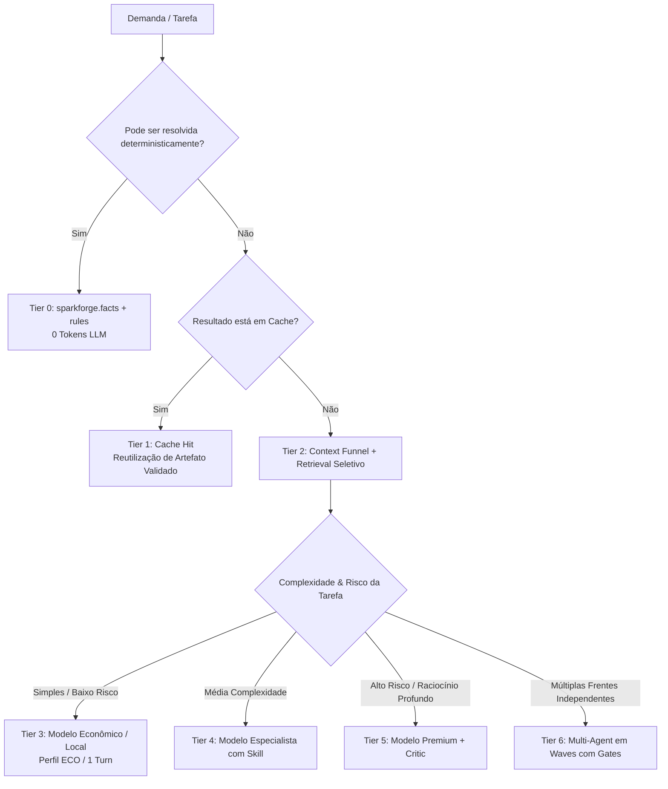

# SparkForge AWS — Course & Reference Knowledge Map (Phase 0)

Mapeamento de conceitos de referências metodológicas externas para a arquitetura do **SparkForge AWS — Data & AWS Agent Factory vNext**.

---

## 1. Mapeamento de Conceitos: engenharia de harness

| Conceito | Fonte | Aplicação no SparkForge | Decisão de Implementação |
|---|---|---|---|
| **Harness Contract** | referência externa | Interfaces executáveis padronizadas para agentes, com inputs/outputs tipados e verificações de pré/pós-condições. | Adotar `TaskSpec` e `ToolManifest` formais em `sparkforge.registry`. Agentes e ferramentas devem operar sob contratos estritos. |
| **Spec Before Build** | referência externa | Geração de especificação estruturada de tarefa (`context`, `objective`, `constraints`, `acceptance`, `validation`, `affected_files`, `risk`, `budget`) antes da execução. | Criar `sparkforge.workflows.spec` para gerar `task.yaml` proporcional à complexidade antes de execuções multi-etapas. |
| **BDD (Given/When/Then)** | referência externa | Cenários de aceite executáveis para validação de comportamentos e rotas de agentes. | Adicionar cenários BDD em `evals/bdd/` cobrindo roteamento, julgamento e exportação de plataformas. |
| **Evals Rigorosos** | referência externa | Rejeição de "parece funcionar" em favor de suites automáticas com métricas quantitativas de assertividade. | Construir `sparkforge.evals` cobrindo golden cases, contratos, regressão e holdout. |
| **Holdout Evaluations** | referência externa | Separação estrita de casos de teste não visíveis ao agente durante o desenvolvimento/runtime para evitar overfitting. | Manter fixtures em `evals/holdout/` não carregadas no contexto de regras ou prompts dos agentes. |
| **Authorization Chain** | referência externa | Classificação de risco de cada ação (`read-only`, `reversible`, `sensitive`, `destructive`) com aprovação humana obrigatória para destrutivas. | Implementar `sparkforge.security.policy` com gates de mutação e verificação de autorização antes de comandos destrutivos. |
| **Waves de Execução** | referência externa | Execução paralela de tarefas independentes e sequencial de dependentes, bloqueada se gates falharem. | Implementar motor de DAG em `sparkforge.workflows.dag` com execução em waves topológicas genéricas (`ExecutionDAG.compute_waves()`), sem os estágios nomeados e numerados descritos em versões anteriores deste documento. |
| **Evidence Before Claims** | referência externa | Requisito inegociável de ancoragem de fatos antes de qualquer conclusão técnica. | Preservar e expandir `sparkforge.findings`: todo Finding deve possuir `evidence` ancorada em `fact_id`s determinísticos. |

---

## 2. Mapeamento de Conceitos: engenharia de contexto e economia de token

| Conceito | Fonte | Aplicação no SparkForge | Decisão de Implementação |
|---|---|---|---|
| **Native AI Engineering** | referência externa | Tratar IA como componente integrado com contratos, limites de tolerância e fallback determinístico. | Arquitetura em camadas (Layer 0 Determinístico até Layer 6 Multi-Agent). |
| **Context Engineering** | referência externa | Context Funnel: `repository` → `candidate files` → `relevant chunks` → `deduplicated evidence` → `minimal context`. | Implementar `sparkforge.context.funnel` e compressão com descarte de ruído e preservação de evidências. |
| **Progressive Disclosure** | referência externa | Dividir conhecimento em níveis progressivos (A: Metadados ~dezenas de tokens; B: Instruções da Skill; C: Referências detalhadas). | Estruturar skills e knowledge packs com `metadata`, `concise.md`, `patterns.md` e referências sob demanda — hoje `skills/*/SKILL.md` é um único arquivo por skill, não os três níveis distintos descritos aqui. |
| **Agentic Memory** | referência externa | Memória intencional separada: Working Memory (tarefa atual), Episodic (histórico), Semantic (regras/fatos), Procedural (como fazer). | Criar `sparkforge.memory` com TTL, confidence, provenance, e invalidation em caso de alteração de arquivo. |
| **Token Economy Cascade** | referência externa | Execução em 7 tiers: Tier 0 Determinístico (0 tokens) → Tier 1 Cache → Tier 2 Retrieval → Tier 3 Cheap → Tier 4 Specialist → Tier 5 Premium → Tier 6 Multi-Agent. | Construir `sparkforge.economy.engine` e `ModelRouter` dinâmico com perfis `ECO` (default), `BALANCED`, `QUALITY`, `OFFLINE`. |
| **Local-First AgentOps** | referência externa | Observabilidade completa de IA (tokens, custo estimado, latência, spans, retries, tool calls) sem exigir serviços pagos na nuvem. | Implementar `sparkforge.observability` gravando traces estruturados em SQLite local / JSONL (`run_id`, `span_id`). |
| **Platform Adapters** | referência externa | Compilação canônica única gerando artefatos para Antigravity, Cursor (`.mdc`), Claude Code, Devin, Windsurf e Open Standards. | Criar `sparkforge.adapters.compiler` com suporte aos 7 targets e testes golden de paridade. |
| **Token Waste Detection** | referência externa | Detecção determinística de loops repetitivos, contextos duplicados, retries estéreis e uso inadequado de modelos premium. | Implementar analisador de desperdício e comando `sparkforge optimize` para sugerir melhorias de eficiência. |

---

## 3. Matriz de Decisão Arquitetural vNext

